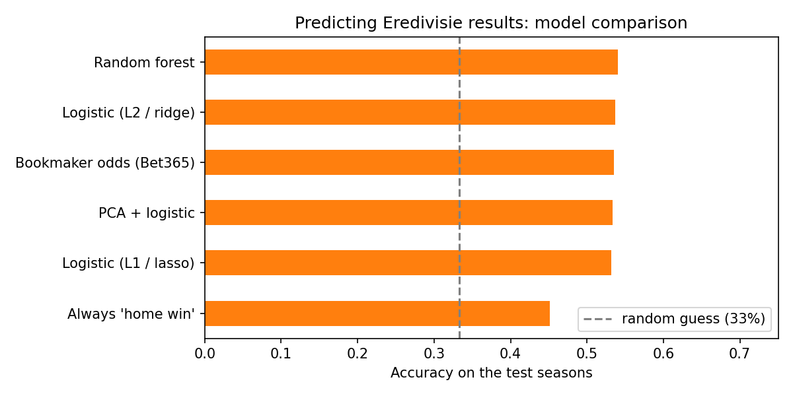

# Predicting Eredivisie Match Results with Machine Learning

Using only what is known **before kick-off**, how well can machine learning
predict whether a Dutch Eredivisie match ends in a home win, a draw or an away
win? And can it beat the bookmakers?

## Data and features

- Every Eredivisie match from 2017/18 to 2025/26 (2,680 matches), from the open [Club Football Match Data](https://github.com/xgabora/Club-Football-Match-Data-2000-2025) set (MIT licence), which is sourced from Football-Data.co.uk and ClubElo.
- **Form features:** each team's average goals scored and conceded, shots, shots on target, corners and points over its **previous 5 matches**, for the home team, the away team and the difference between them.
- **Elo difference:** the gap between the two teams' Elo ratings before the match.
- The features never use the match itself or anything after it. A test checks this.

## Models

| Model | Why it's included |
| --- | --- |
| Logistic regression, L2 penalty (ridge) | Simple, interpretable baseline that shrinks all coefficients |
| Logistic regression, L1 penalty (lasso) | Sets unhelpful features to exactly zero, so it selects features |
| PCA + logistic regression | Compresses the correlated form features into a few components first |
| Random forest | Captures non-linear effects and interactions |

Settings are tuned with **grid search** and **time-series cross-validation** (`TimeSeriesSplit`): each fold trains on earlier matches and validates on later ones. Random K-fold would let the model learn from the future.

## Results

The models are trained on 2017/18 to 2023/24 and tested on **2024/25 and 2025/26**, which they never saw (607 matches):

| Model | Accuracy | Log loss |
| --- | --- | --- |
| Random forest | 54.0% | 0.983 |
| Logistic (L2 / ridge) | 53.7% | 0.980 |
| PCA + logistic | 53.4% | 0.978 |
| Logistic (L1 / lasso) | 53.2% | 0.973 |
| *Bookmaker odds (Bet365)* | *53.5%* | *0.959* |
| *Always "home win"* | *45.1%* | |



- **All models clearly beat the simple rule** of always picking the home team (45%), and they match the bookmaker's accuracy.
- **The bookmaker still has better probabilities.** Its log loss is lower (0.959 against 0.973 or more), so the models do not "beat the bookies".
- **The Elo difference is by far the most important feature.** The lasso kept only 6 of the 19 features. For the random forest, recent shots on target mattered most after Elo.
- **Robustness:** accuracy was similar in both test seasons (51 to 55%). The four models are close together, so the simpler logistic models are about as good as the random forest and much easier to explain.
- **Draws are the hard part.** About 23% of matches are draws, and none of the models predicts them well. This is a known problem in football prediction.

## How to run

```
pip install -r requirements.txt
python football.py     # downloads the data the first time and saves the Eredivisie part to eredivisie.csv
pytest                 # 4 small tests
```

## Files

- `football.py`: data download, feature engineering, models, tuning and evaluation
- `test_football.py`: tests on a small made-up league (no future information in the features, time-ordered split)
- `model_comparison.png`, `results.csv`, `feature_importance.csv`: output of the last run

## Limitations

- Promoted teams have no recent Eredivisie matches, so their first few matches after promotion are left out.
- Only 5-match averages are used as form. Longer windows or expected goals (xG) could help.
- 607 test matches is a small sample, so differences of about 1 percentage point between models are not meaningful.
